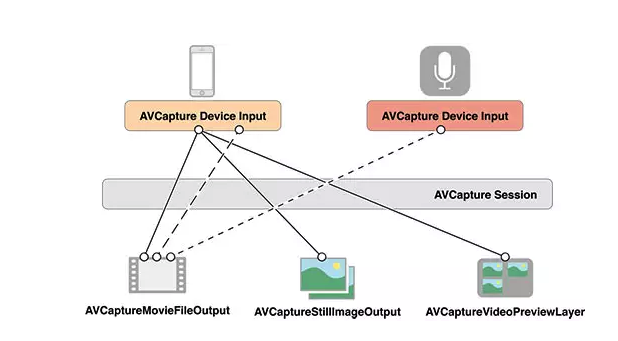

# <center><font color=red> OpenGL ES 教程 </font></center>


OpenGL ES 只是一个规范函数，需要使用专门的编程语言实现其所需要的图像绘制功能。

OpenGL自身是一个巨大的状态机(State Machine)：一系列的变量描述OpenGL此刻应当如何运行。 `OpenGL 的状态通常被称为 OpenGL 上下文(Context)`,通常是通过 `设置选项` `操作缓冲` 改变OpenGL 的状态最后使用当前OpenGL上下文实现渲染。

通过上述就可以知道了，我们实现OpenGL 去绘制时就是不断的改变OpenGL的状态实现的。

### > OpenGL 基础类型

对于OpenGL的基础类型，有点类似于 iOS-OC语言中的 Foundation框架中对于数组、字典、字符串等的描述。在本语言使用的类型中，加上自己需要使用的前缀作为本语言的基础语言。

如 float -> GLfloat,int->GLint uint->GLuint.

### <table><td bgcolor=	#FFFFF0> <font size=3>   对象 </font> </td></table>

OpenGL库是用C语言写的，同时也支持多种语言的派生，但其内核仍是一个C库。由于C的一些语言结构不易被翻译到其它的高级语言，因此OpenGL开发的时候引入了一些抽象层。“对象(Object)”就是其中一个。

在OpenGL中一个对象是指一些选项的集合，它代表OpenGL状态的一个子集。比如，我们可以用一个对象来代表绘图窗口的设置，之后我们就可以设置它的大小、支持的颜色位数等等。可以把对象看做一个C风格的结构体(Struct)：

```
struct object_name {
    float  option1;
    int    option2;
    char[] name;
};
```

当我们使用一个对象时，通常看起来像如下一样（把OpenGL上下文看作一个大的结构体）：

```
// OpenGL的状态
struct OpenGL_Context {
    ...
    object* object_Window_Target;
    ...     
};
```

```
// 创建对象
unsigned int objectId = 0;
glGenObject(1, &objectId);
// 绑定对象至上下文
glBindObject(GL_WINDOW_TARGET, objectId);
// 设置当前绑定到 GL_WINDOW_TARGET 的对象的一些选项
glSetObjectOption(GL_WINDOW_TARGET, GL_OPTION_WINDOW_WIDTH, 800);
glSetObjectOption(GL_WINDOW_TARGET, GL_OPTION_WINDOW_HEIGHT, 600);
// 将上下文对象设回默认
glBindObject(GL_WINDOW_TARGET, 0);

这一小段代码展现了以后使用 OpenGL 时常见的工作流。
	我们首先创建一个对象，然后用一个id保存它的引用（实际数据被储存在后台）。
	然后我们将对象绑定至上下文的目标位置（例子中窗口对象目标的位置被定义成GL_WINDOW_TARGET）。
	接下来我们设置窗口的选项。
	最后我们将目标位置的对象id设回0，解绑这个对象。
	设置的选项将被保存在objectId所引用的对象中，一旦我们重新绑定这个对象到GL_WINDOW_TARGET位置，这些选项就会重新生效。
```


### <table><td bgcolor=	#FFFFF0> <font size=3>  顶点数组 </font> </td></table>

```
顶点数组对象：Vertex Array Object，VAO
顶点缓冲对象：Vertex Buffer Object，VBO
索引缓冲对象：Element Buffer Object，EBO或Index Buffer Object，IBO
```


<h2 id="">  <font size=4> iOS -- OpenGL ES </font> </h2>

OpenGL ES Apple官方英文介绍是这么说的 : `Create 3D and 2D graphics effects with this compact, efficient subset of OpenGL`  即OpenGL ES 可创建2D 3D 图形效果。

官方介绍地址： [OpenGL ES](https://developer.apple.com/documentation/opengles?language=objc)

```
https://developer.apple.com/documentation/opengles?language=objc
```


##### `OpenGL ES` 是实际上就是一个API函数，包含一系列可以操作图形和图像的函数。 `OpenGL` 规范严格规定了每个函数该如何执行，以及它们的输出值.


#### <table><td bgcolor=	#FFFFF0> <font size=3>   OpenGL ES 入门 基本使用操作 -- 点/线绘制 </font> </td></table>

导入头文件 

```
// <file/file.h>
#import <GLKit/GLKit.h>
#import <CoreImage/CoreImage.h>
```

#### > 1. 新建OpenGL ES上下文

<font color=#8E236B> EAGLContext 的使用，首次被弃用出现在 `iOS12.0` 上 </font>

```
@interface ViewController ()

@property (nonatomic,strong)EAGLContext *mainContext;

// 'EAGLContext' is deprecated: first deprecated in iOS 12.0 - OpenGLES API deprecated. (Define GLES_SILENCE_DEPRECATION to silence these warnings)

@property (nonatomic , assign) int indicesCount;

@property (nonatomic , strong) GLKBaseEffect* baseEffect;

@end 

@implementation ViewController

// 创建 OpenGL ES 上下文
- (void)createOpenGLContext{
	 _mainContext = [[EAGLContext alloc]initWithAPI:kEAGLRenderingAPIOpenGLES2]; //2.0，还有1.0和3.0
    if (!_mainContext) {
        NSLog(@"Failed to initialize OpenGLES 2.0 context");
        exit(1);
    }

    // 设置为当前上下文
    if (![EAGLContext setCurrentContext:_mainContext]) {
        NSLog(@"Failed to set current OpenGL context");
        exit(1);
    }

// first use `GLKView`,please import `#import <GLKit/GLKView.h>`    
    GLKView *glkV = [[GLKView alloc]init];
    glkV.context = self.mainContext;
    glkV.drawableColorFormat = GLKViewDrawableColorFormatRGBA8888; // 颜色缓冲区格式
}

@end

```

### > 2-1 着色器着色 -- 先着色器配置，在绘制相应图形

在上述所有的步骤, `顶点数组` 和 `索引数组` 创建和配置完毕后，即可生成一个矩形。

我们若是需要生成的图形有颜色，就需要配置相应的着色器进行着色步骤。

新建 `.glsl` 文件，顶点数据着色器，片段数据着色器 -- <font color=#8E236B>在 `.glsl` 着色器的配置文件中不要出现中文，否则最后会出现链接不成功。</font>

#### 一个典型的着色器有以下的结构

```
#version version_number
in type in_variable_name;
in type in_variable_name;

out type out_variable_name;

uniform type uniform_name;

int main()
{
  // 处理输入并进行一些图形操作
  ...
  // 输出处理过的结果到输出变量
  out_variable_name = weird_stuff_we_processed;
}

/*
着色器的开头总是要声明版本
输入输出变量
uniform 和 main函数 （着色器的入口点就是 main 函数）
*/
```


GraphicVertex.glsl -->

```
//1.声明一个输入属性数组 -- 一个名为vertexShaderPosition的4分量向量
//3.main函数表示着色器执行的开始
//4.着色器主体：将vertexShaderPosition输入属性拷贝到名为gl_Position的特殊输出变量，
//每个顶点着色器必须在gl_Position变量中输出一个位置，这个变量定义传递到线管下一个阶段的位置。

//vertex shader
attribute vec4 vertexShaderPosition;
void main(void) {
    gl_Position = vertexShaderPosition;
}
```

GraphicFragment.glsl --> 

```
// 第一行是声明着色器中浮点变量的默认精度。
// 第二行表示着色器的入口函数
// 第三行入口函数主体代码，一个4分享的值被输出到颜色缓冲区，它表示的是最终的输出颜色。

// fragment shader

precision mediump float;
void main(void) {
    gl_FragColor = vec4(1.0, 0.0, 0.0, 1.0);
}
```

创建 program 对象: -- 这是在编译shader对象后，接下来需要把它链接到 `OpenGL` 的 `glProgram` 上，让它可以在GPU上run起来。

```
#pragma mark - create `program` object
- (void)compileShadersCreatProgram{
// 1. 生成 shader 对象
    // **  generate vertex shader  **
    GLuint vertexShader = [self compileShaderWithName:@"GraphicVertex" shaderType:GL_VERTEX_SHADER];

    // generate fragment shader
    GLuint fragmentShader = [self compileShaderWithName:@"GraphicFragment" shaderType:GL_FRAGMENT_SHADER];
    
// 2. 把 shader 链接到 OpenGL 的 glProgram上。
    // ....
    GLuint programHandle = glCreateProgram(); //
    glAttachShader(programHandle, vertexShader); // link vertex shader
    glAttachShader(programHandle, fragmentShader); // link fragment shader
    glLinkProgram(programHandle); // link program
    
    // after shader object link program,delete shader object
    //glDeleteShader(vertexShader);
    //glDeleteShader(fragmentShader);
    
    // use `glGetProgramiv` to test error or not
    GLint linkSuccess;
    glGetProgramiv(programHandle, GL_LINK_STATUS, &linkSuccess);
    
    if (linkSuccess == GL_FALSE) {
        GLchar messages[256];
        NSString *messageString = [NSString stringWithUTF8String:messages];
        NSLog(@"shader program:%@", messageString);
        exit(1);
    }
    
    // use `glUseProgram` bind program object,let `OpenGL ES` execute program to rendering.
    glUseProgram(programHandle);
    
    // 把“顶点属性索引”绑定到“顶点属性名” --> program object -->GraphicVertex.glsl/vertexShaderPosition
    glGetAttribLocation(programHandle, "vertexShaderPosition"); 
}

/**
完成上面的步骤后，我们就可以用programe来和shader交互了，比如赋值给顶点shader的position变量
（即创建顶点数组进行绘制）

GLuint attrib_position = glGetAttribLocation(program, "position");
glEnableVertexAttribArray(attrib_position);
glVertexAttribPointer(attrib_position, 3, GL_FLOAT, GL_FALSE, 6 * sizeof(GLfloat), (char *)points);
*/
```

生成 `Shader` 着色器: -- 运行时动态编译源码以得到一个着色器对象。而且编译shader的流程是固定的。

```
//  package create `shader` object
- (GLuint)compileShaderWithName:(NSString *)shaderName shaderType:(GLenum)shaderType{
    // *** this 'glsl' file can't exist Chinese ***
    NSString *shaderPath = [[NSBundle mainBundle]pathForResource:shaderName ofType:@"glsl"];
    // read shader string origin code
    NSError *error;
    NSString *shaderStr = [NSString stringWithContentsOfFile:shaderPath encoding:NSUTF8StringEncoding error:&error];
    
    
    if((shaderStr.length == 0) || !shaderStr){
        exit(1);
    }
    
// create shader object
    GLuint shader;
    shader = glCreateShader(shaderType);
    
    // use `glShaderSource` 将着色器源码加载到上面生成的着色器对象上
    const char* shaderStrUTF8 = [shaderStr UTF8String];
    int shaderStrLength = (int)shaderStr.length;
    glShaderSource(shader, 1, &shaderStrUTF8, &shaderStrLength);
    
    // 调用glCompileShader 在运行时编译shader
    glCompileShader(shader);
    
    // glGetShaderiv检查编译错误（然后退出）
    GLint compileSuccess;
    glGetShaderiv(shader, GL_COMPILE_STATUS, &compileSuccess);
    if (compileSuccess == GL_FALSE) {
        GLchar messages[256];
        NSString *messageString = [NSString stringWithUTF8String:messages];
        NSLog(@"%@", messageString);
        exit(1);
    }
    return shader;
}

```


#### > 2-2. 顶点数组和索引数组 -- OpenGL ES 坐标系和纹理坐标系

<font color=#8E236B>由于 OpenGL 主要绘制三角形，所有图形，皆由其设定顶点数据和顺序后组成。</font>

```
/*  图形绘制
 *  三角形，矩形(OpenGL 主要绘制三角形)
 */
 
// OpenGL ES 的坐标系原点在 (0,0) 在屏幕中间。
//顶点数组数据，前三个是顶点坐标（x、y、z轴），后面两个是纹理坐标（x，y）
	// 索引缓冲对象
    GLfloat squareVertexData[] = {
        0.5, 0.5, -0.0f,    1.0f, 1.0f, //右上
        0.5, -0.5, 0.0f,    1.0f, 0.0f, //右下
        -0.5, 0.5, 0.0f,    0.0f, 1.0f, //左上
        -0.5, -0.5, 0.0f,   0.0f, 0.0f, //左下
        /*  顶点数据的顺序不同生成的图形不同
        0.5, -0.5, 0.0f,    1.0f, 0.0f, //右下
        -0.5, 0.5, 0.0f,    0.0f, 1.0f, //左上
        -0.5, -0.5, 0.0f,   0.0f, 0.0f, //左下
        0.5, 0.5, -0.0f,    1.0f, 1.0f, //右上
        */    
    };
// 数组中只存储不同的顶点，并设定绘制这些顶点的顺序。
    
```

```
//顶点索引 --- // 注意索引从0开始! 
    GLuint indices[] =
    {
        0,1,2, // 第一个三角形
        1,3,0 //第二个三角形
    };
    self.indicesCount = sizeof(indices) / sizeof(GLuint);
```
 `顶点数组` 里包括顶点坐标，OpenGL ES 的 <font color=red> 坐标系原点在 (0,0) 在屏幕中间。</font>

 `纹理坐标系` 的取值范围是[0, 1]，<font color=red>原点(0, 0)在左下角，点(1, 1)在右上角。  </font>

`索引数组` 是顶点数组的索引，把 vertexData 数组看成4个顶点，每个顶点会有5个GLfloat数据，索引从0开始。


### > 2-3. 顶点数据缓存 --- 绘制

```
//顶点数据缓存
    GLuint buffer;
    glGenBuffers(1, &buffer);
    glBindBuffer(GL_ARRAY_BUFFER, buffer);
    glBufferData(GL_ARRAY_BUFFER, sizeof(squareVertexData), squareVertexData, GL_STATIC_DRAW);

    GLuint index;
    glGenBuffers(1, &index);
    glBindBuffer(GL_ELEMENT_ARRAY_BUFFER, index);
    glBufferData(GL_ELEMENT_ARRAY_BUFFER, sizeof(indices), indices, GL_STATIC_DRAW);
    //
    glEnableVertexAttribArray(GLKVertexAttribPosition);
    glVertexAttribPointer(GLKVertexAttribPosition, 3, GL_FLOAT, GL_FALSE, sizeof(GLfloat) * 5, (GLfloat *)NULL + 0);
    glEnableVertexAttribArray(GLKVertexAttribTexCoord0); // 纹理
    glVertexAttribPointer(GLKVertexAttribTexCoord0, 2, GL_FLOAT, GL_FALSE, sizeof(GLfloat) * 5, (GLfloat *)NULL + 3);
    
// 注意： 释义
glGenBuffers	申请一个标识符
glBindBuffer	把标识符绑定到GL_ARRAY_BUFFER上
glBufferData	用户定义的数据复制到当前绑定缓冲的函数
	它的第一个参数是目标缓冲的类型：顶点缓冲对象当前绑定到GL_ARRAY_BUFFER目标上。
	第二个参数指定传输数据的大小(以字节为单位)；用一个简单的sizeof计算出顶点数据大小就行。
	第三个参数是我们希望发送的实际数据。
	第四个参数指定了我们希望显卡如何管理给定的数据。它有三种形式：
		GL_STATIC_DRAW ：数据不会或几乎不会改变。
		GL_DYNAMIC_DRAW：数据会被改变很多。
		GL_STREAM_DRAW ：数据每次绘制时都会改变。

glEnableVertexAttribArray 	开启对应的顶点属性
glVertexAttribPointer	设置合适的格式从buffer里面读取数据,即告诉OpenGL该如何解析数据

/*
glVertexAttribPointer函数的参数非常多，下面逐一说明:
第一个参数GLuint indx:指定要配置的顶点属性，设置数据传递到指定位置顶点属性中
第二个参数GLint size：指定顶点属性的大小
第三个参数GLenum type：指定数据的类型，这里是GL_FLOAT(GLSL中vec*都是由浮点数值组成的)
第四个参数GLboolean normalized：定义数据是否被标准化(Normalize)。如果设置为GL_TRUE，所有数据都会被映射到0（对于有符号型signed数据是-1）到1之间。因为我们传入的数据就是标准化数据，所以我们把它设置为GL_FALSE
第五个参数GLsizei stride：设置连续的顶点属性组之间的间隔。由于下个组位置数据在3个float之后，
        我们把步长设置为3 * sizeof(float)。要注意的是由于我们知道这个数组是紧密排列的（在两个顶点属性之间没有空隙）我们也可以设置为0来让OpenGL决定具体步长是多少（只有当数值是紧密排列时才可用）。
        一旦我们有更多的顶点属性，我们就必须更小心地定义每个顶点属性之间的间隔，我们在后面会看到更多的例子
      （这个参数的意思简单说就是从这个属性第二次出现的地方到整个数组0位置之间有多少字节）
最后一个参数const GLvoid *ptr：类型是void*，所以需要我们进行这个奇怪的强制类型转换。它表示位置数据在缓冲中起始位置的偏移量(Offset)。由于位置数据在数组的开头，所以这里是0。
*/
```


### > 2-4 规范绘制的步骤

```
 /*
 // OpenGL 绘制步骤
 // 1. 使用一个顶点缓冲对象将顶点数据初始化至缓冲区中
 // 2. 建立了一个顶点和一个片段着色器程序对象
 // 3. 告诉OpenGL如何把顶点数据链接到顶点着色器的顶点属性上
 // 4. 最后只需要调用绘制函数 glDrawArrays 进行绘制
*/

// ..:: 初始化代码 :: ..
// 1. 绑定顶点数组对象
glBindVertexArray(VAO);
// 2. 把我们的顶点数组复制到一个顶点缓冲中，供OpenGL使用
glBindBuffer(GL_ARRAY_BUFFER, VBO);
glBufferData(GL_ARRAY_BUFFER, sizeof(vertices), vertices, GL_STATIC_DRAW);
// 3. 复制我们的索引数组到一个索引缓冲中，供OpenGL使用
glBindBuffer(GL_ELEMENT_ARRAY_BUFFER, EBO);
glBufferData(GL_ELEMENT_ARRAY_BUFFER, sizeof(indices), indices, GL_STATIC_DRAW);
// 4. 设定顶点属性指针
glVertexAttribPointer(0, 3, GL_FLOAT, GL_FALSE, 3 * sizeof(float), (void*)0);
glEnableVertexAttribArray(0);

[...]

// ..:: 绘制代码（渲染循环中） :: ..
glUseProgram(shaderProgram);
glBindVertexArray(VAO);
glDrawElements(GL_TRIANGLES, 6, GL_UNSIGNED_INT, 0)
glBindVertexArray(0);
```

所有几何图元的绘制都是通过调用 `glDrawArrays` 实现的：

```
	glDrawArrays (GLenum mode, GLint first, GLsizei count);
```

这里的mode为几何形状类型，主要有点，线和三角形三种：

```
#define GL_POINTS           0x0000  // 点     -> 默认为方形
#define GL_LINES            0x0001  // 线段   -> 可不连续
#define GL_LINE_LOOP        0x0002  // 线圈   -> 首尾相连的线段
#define GL_LINE_STRIP       0x0003  // 线段带 -> 相邻线段共享顶点
#define GL_TRIANGLES        0x0004  // 三角形 -> 三个顶点连接
#define GL_TRIANGLE_STRIP   0x0005  // 三角带 -> 相邻三角共享边
#define GL_TRIANGLE_FAN     0x0006  // 三角扇 -> 所有三角共享顶点
```


### <table><td bgcolor=#FFFFF0><font size=4> 读取图片信息并绘制屏幕 -- 纹理使用  </font></td></table>

#### > 1. 读取图片生成 TextTure纹理信息


```
/*  图片信息读取并绘制至屏幕
 */


	CVOpenGLESTextureCacheRef coreVideoTextureCache;
    CVPixelBufferRef renderTarget;
    CVOpenGLESTextureRef renderTexture;
    CVOpenGLESTextureCacheCreate(kCFAllocatorDefault, NULL, self.mainContext, NULL, &coreVideoTextureCache);
    
    UIImage *screenImg = [UIImage imageNamed:@"Demo1.png"];
    renderTarget = [self pixelBufferRefFromCGImage:screenImg.CGImage];
    
    CVReturn err = CVOpenGLESTextureCacheCreateTextureFromImage (kCFAllocatorDefault, coreVideoTextureCache, renderTarget,
                                                                 NULL, // texture attributes
                                                                 GL_TEXTURE_2D,
                                                                 GL_RGBA, // opengl format
                                                                 (int)CGImageGetWidth(screenImg.CGImage),
                                                                 (int)CGImageGetHeight(screenImg.CGImage),
                                                                 GL_RGBA, // native iOS format
                                                                 GL_UNSIGNED_BYTE,
                                                                 0,
                                                                 &renderTexture);
    if (err)
    {
        NSAssert(NO, @"Error at CVOpenGLESTextureCacheCreateTextureFromImage %d", err);
    }
    
    glBindTexture(CVOpenGLESTextureGetTarget(renderTexture), CVOpenGLESTextureGetName(renderTexture));
    
```


#### > 2. 读取图片 Texture 纹理信息，并进行着色，反向在 屏幕 UIView生成图片 UIImage.

读取图片生成  `CVPixelBufferRef` Texture 纹理信息

```
// 读取图片生成 TextTure纹理信息
    CVOpenGLESTextureCacheRef coreVideoTextureCache;
    CVPixelBufferRef renderTarget;
    CVOpenGLESTextureRef renderTexture;
    CVOpenGLESTextureCacheCreate(kCFAllocatorDefault, NULL, self.mainContext, NULL, &coreVideoTextureCache);
    
    UIImage *screenImg = [UIImage imageNamed:@"Demo1.png"];
    renderTarget = [self pixelBufferRefFromCGImage:screenImg.CGImage];
    
    CVReturn err = CVOpenGLESTextureCacheCreateTextureFromImage (kCFAllocatorDefault, coreVideoTextureCache, renderTarget,
                                                                 NULL, // texture attributes
                                                                 GL_TEXTURE_2D,
                                                                 GL_RGBA, // opengl format
                                                                 (int)CGImageGetWidth(screenImg.CGImage),
                                                                 (int)CGImageGetHeight(screenImg.CGImage),
                                                                 GL_RGBA, // native iOS format
                                                                 GL_UNSIGNED_BYTE,
                                                                 0,
                                                                 &renderTexture);
    if (err)
    {
        NSAssert(NO, @"Error at CVOpenGLESTextureCacheCreateTextureFromImage %d", err);
    }
    
    glBindTexture(CVOpenGLESTextureGetTarget(renderTexture), CVOpenGLESTextureGetName(renderTexture));
    
```

读取图片，创建纹理

```
// GLKTextureLoader读取图片,创建纹理 CLKTextureInfo
    NSDictionary *options = [NSDictionary dictionaryWithObjectsAndKeys:@(1),GLKTextureLoaderOriginBottomLeft, nil]; // 纹理坐标系是相反的设置
    NSString *demoFilePath = [[NSBundle mainBundle]pathForResource:@"Demo1" ofType:@"png"];
    GLKTextureInfo *textureInfo = [GLKTextureLoader textureWithContentsOfFile:demoFilePath options:options error:nil];
```

创建着色器 GLKBaseEffect ，把纹理赋值给着色器

```
	self.baseEffect = [[GLKBaseEffect alloc]init];
    self.baseEffect.texture2d0.enabled = GL_TRUE;
    self.baseEffect.texture2d0.name = CVOpenGLESTextureGetName(renderTarget); //textureInfo.name
    
```

根据生成的原本的图片 textTure 纹理信息在 反向 生成 图片

```
    UIImage *textImg = [self generateImageFromCVPixelBufferRef:renderTarget];
    UIImageView* imageView = [[UIImageView alloc] initWithImage:textImg];
    [self.view addSubview:imageView];  
```

### >  渲染场景代码 -- GLKView independence use -- delegate 不论是OpenGL ES还是UIImage绘制到界面上都需要调用此 GLKView delegate 来进行代理中的 `view` 进行的渲染。

```
- (void)glkView:(GLKView *)view drawInRect:(CGRect)rect {
// 改变渲染的屏幕背景色
    glClearColor(0.3f, 0.6f, 1.0f, 1.0f);
    glClear(GL_COLOR_BUFFER_BIT | GL_DEPTH_BUFFER_BIT);
    
    //启动着色器
    [self.baseEffect prepareToDraw];
    glDrawElements(GL_TRIANGLES, self.indicesCount, GL_UNSIGNED_INT, 0);
}
```

### <font color=#8E236B> > 根据 UIImage --> 生成图片纹理相关信息 </font>

```
- (CVPixelBufferRef)pixelBufferRefFromCGImage:(CGImageRef)imgRef{
    NSDictionary *options = @{
                             (NSString*)kCVPixelBufferCGImageCompatibilityKey : @YES,
                             (NSString*)kCVPixelBufferCGBitmapContextCompatibilityKey : @YES,
                             (NSString*)kCVPixelBufferIOSurfacePropertiesKey: [NSDictionary dictionary]
                             };
    CVPixelBufferRef pixelBuffer = NULL;

    CGFloat frameWidth = CGImageGetWidth(imgRef);
    CGFloat frameHeight = CGImageGetHeight(imgRef);
    CVReturn status = CVPixelBufferCreate(kCFAllocatorDefault,
                                          frameWidth,
                                          frameHeight,
                                          kCVPixelFormatType_32BGRA,
                                          (__bridge CFDictionaryRef) options,
                                          &pixelBuffer);
    
    NSParameterAssert(status == kCVReturnSuccess && pixelBuffer != NULL);
    
    CVPixelBufferLockBaseAddress(pixelBuffer, 0);
    void *pixelData = CVPixelBufferGetBaseAddress(pixelBuffer);
    NSParameterAssert(pixelData != NULL);
    
    CGColorSpaceRef rgbColorSpace = CGColorSpaceCreateDeviceRGB();
    
    CGContextRef context = CGBitmapContextCreate(pixelData,
                                                 frameWidth,
                                                 frameHeight,
                                                 8,
                                                 CVPixelBufferGetBytesPerRow(pixelBuffer),
                                                 rgbColorSpace,
                                                 (CGBitmapInfo)kCGImageAlphaNoneSkipFirst);
    NSParameterAssert(context);
    CGContextConcatCTM(context, CGAffineTransformIdentity);
    CGContextDrawImage(context, CGRectMake(0,
                                           0,
                                           frameWidth,
                                           frameHeight),
                       imgRef);
    CGColorSpaceRelease(rgbColorSpace);
    CGContextRelease(context);
    
    CVPixelBufferUnlockBaseAddress(pixelBuffer, 0);
    
    return pixelBuffer;
}
```


### <font color=#8E236B> > 图片纹理相关信息 --> generate UIImage </font>

```
- (UIImage *)generateImageFromCVPixelBufferRef:(CVPixelBufferRef)pixelBufferRef{
    CVImageBufferRef imgBuffer = pixelBufferRef;
    
    CVPixelBufferLockBaseAddress(imgBuffer, 0);
    void *baseAddress = CVPixelBufferGetBaseAddress(imgBuffer);
    size_t width = CVPixelBufferGetWidth(imgBuffer);
    size_t height = CVPixelBufferGetHeight(imgBuffer);
    size_t bufferSize = CVPixelBufferGetDataSize(imgBuffer);
    size_t bytesPerRow = CVPixelBufferGetWidthOfPlane(imgBuffer, 0);
    
    
    CGColorSpaceRef rgbColorSpace = CGColorSpaceCreateDeviceRGB();
    CGDataProviderRef provider = CGDataProviderCreateWithData(NULL, baseAddress, bufferSize, NULL);
    
    CGImageRef cgImage = CGImageCreate(width, height, 8, 32, bytesPerRow, rgbColorSpace, kCGImageAlphaNoneSkipFirst | kCGBitmapByteOrderDefault, provider, NULL, true, kCGRenderingIntentDefault);
    
    UIImage *image = [UIImage imageWithCGImage:cgImage];
    
    CGImageRelease(cgImage);
    CGDataProviderRelease(provider);
    CGColorSpaceRelease(rgbColorSpace);
    
    CVPixelBufferUnlockBaseAddress(imgBuffer, 0);
    
    return image;
}
```


#### <table><td bgcolor=	#FFFFF0> <font size=4> 摄像头采集数据和渲染 </font> </td></table>

### 1. 摄像头采集 --- AVFoundation

AVFoundation常用类：

```
AVCaptureDevice : 输入设备，包括摄像头和麦克风
AVCaptureInput : 输入数据源
AVCaptureOutput : 输出数据源
AVCaptureSession : 会话，协调输入与输出之间的数据流
AVCaptureVideoPreviewLayer : 预览效果的Layer
```




采集流程：

```
@property (nonatomic, strong) AVCaptureSession *captureSession; //负责输入和输出设备之间的数据传递
@property (nonatomic, strong) AVCaptureDeviceInput *captureDeviceInput;//负责从AVCaptureDevice获得输入数据
@property (nonatomic, strong) AVCaptureVideoDataOutput *captureDeviceOutput; //output
{
    dispatch_queue_t processQueue;
}
```

1.新建会话，设置图像大小；创建处理队列。

```
	self.captureSession = [[AVCaptureSession alloc] init];
   self.captureSession.sessionPreset = AVCaptureSessionPreset640x480;
   processQueue = dispatch_get_global_queue(DISPATCH_QUEUE_PRIORITY_HIGH, 0);
```

2.新建摄像头输入，设置为前置摄像头；创建设备输入，并添加到会话。

```
	AVCaptureDevice *inputCamera = nil;
    NSArray *devices = [AVCaptureDevice devicesWithMediaType:AVMediaTypeVideo];
    for (AVCaptureDevice *device in devices)
    {
        if ([device position] == AVCaptureDevicePositionFront)
        {
            inputCamera = device;
        }
    }
    self.captureDeviceInput = [[AVCaptureDeviceInput alloc] initWithDevice:inputCamera error:nil];
    if ([self.captureSession canAddInput: self.captureDeviceInput]) {
        [self.captureSession addInput: self.captureDeviceInput];
    }
```

3.创建数据输出，设置代理和输出格式，添加到会话。

```
	self.captureDeviceOutput = [[AVCaptureVideoDataOutput alloc] init];
    [self.captureDeviceOutput setAlwaysDiscardsLateVideoFrames:NO];
    self.mGLView.isFullYUVRange = NO;
    [self.captureDeviceOutput setVideoSettings:[NSDictionary dictionaryWithObject:[NSNumber numberWithInt:kCVPixelFormatType_420YpCbCr8BiPlanarVideoRange] forKey:(id)kCVPixelBufferPixelFormatTypeKey]];
    [self.captureDeviceOutput setSampleBufferDelegate:self queue:processQueue];
    if ([self.captureSession canAddOutput: self.captureDeviceOutput]) {
        [self.captureSession addOutput: self.captureDeviceOutput];
    }
    AVCaptureConnection *connection = [self.captureDeviceOutput connectionWithMediaType:AVMediaTypeVideo];
    [connection setVideoOrientation:AVCaptureVideoOrientationPortraitUpsideDown];
```
 
4.开始录制，在代理(delegate)中接收图像帧数据

* 开始会话

```
[self.captureSession startRunning];
```

* 处理图像帧

```
	 CVPixelBufferRef pixelBuffer = CMSampleBufferGetImageBuffer(sampleBuffer);
    [self.mGLView displayPixelBuffer:pixelBuffer];
```


### 2. 图像数据创建纹理 ---   GPUImage

这一部分的代码参考自 `GPUImage` 的 `GPUImageVideoCamera` 类，YUV视频帧分为亮度和色度两个纹理，分别用 `GL_LUMINANCE` 格式和 `GL_LUMINANCE_ALPHA` 格式读取。

* 亮度纹理

```
glActiveTexture(GL_TEXTURE0);
        err = CVOpenGLESTextureCacheCreateTextureFromImage(kCFAllocatorDefault,
                                                           _videoTextureCache,
                                                           pixelBuffer,
                                                           NULL,
                                                           GL_TEXTURE_2D,
                                                           GL_LUMINANCE,
                                                           frameWidth,
                                                           frameHeight,
                                                           GL_LUMINANCE,
                                                           GL_UNSIGNED_BYTE,
                                                           0,
                                                           &_lumaTexture);
// 配置亮度纹理属性
	glBindTexture(CVOpenGLESTextureGetTarget(_lumaTexture), CVOpenGLESTextureGetName(_lumaTexture));
   glTexParameteri(GL_TEXTURE_2D, GL_TEXTURE_MIN_FILTER, GL_LINEAR);
   glTexParameteri(GL_TEXTURE_2D, GL_TEXTURE_MAG_FILTER, GL_LINEAR);
   glTexParameterf(GL_TEXTURE_2D, GL_TEXTURE_WRAP_S, GL_CLAMP_TO_EDGE);
   glTexParameterf(GL_TEXTURE_2D, GL_TEXTURE_WRAP_T, GL_CLAMP_TO_EDGE);
```

*  色度纹理

```
glActiveTexture(GL_TEXTURE1);
        err = CVOpenGLESTextureCacheCreateTextureFromImage(kCFAllocatorDefault,
                                                           _videoTextureCache,
                                                           pixelBuffer,
                                                           NULL,
                                                           GL_TEXTURE_2D,
                                                           GL_LUMINANCE_ALPHA,
                                                           frameWidth / 2,
                                                           frameHeight / 2,
                                                           GL_LUMINANCE_ALPHA,
                                                           GL_UNSIGNED_BYTE,
                                                           1,
                                                           &_chromaTexture);
                                                           
/// 配置色度纹理属性
glBindTexture(CVOpenGLESTextureGetTarget(_chromaTexture), CVOpenGLESTextureGetName(_chromaTexture))；
        glTexParameteri(GL_TEXTURE_2D, GL_TEXTURE_MIN_FILTER, GL_LINEAR);
        glTexParameteri(GL_TEXTURE_2D, GL_TEXTURE_MAG_FILTER, GL_LINEAR);
        glTexParameterf(GL_TEXTURE_2D, GL_TEXTURE_WRAP_S, GL_CLAMP_TO_EDGE);
        glTexParameterf(GL_TEXTURE_2D, GL_TEXTURE_WRAP_T, GL_CLAMP_TO_EDGE);
```


### 3. OpenGL ES 渲染 --- OpenGL ES

#### <table><td bgcolor=	#FFFFF0> <font size=4>  。。。 </font> </td></table>

#### <table><td bgcolor=	#FFFFF0> <font size=4>  。。。 </font> </td></table>


### OpenGL ES 可学习的教程地址： 

```
iOS -- OpenGL ES 的总体讲解： http://www.cocoachina.com/ios/20180906/24799.html --- 后面带有 教程链接
简书OpenGL ES专题教程 --- 	 https://www.jianshu.com/nb/2135411
Learn OpenGL ES 博客教程图形学 ---	 https://learnopengl-cn.github.io/
简书 OpenGL ES分散教程 --- 	 https://github.com/loyinglin
```


